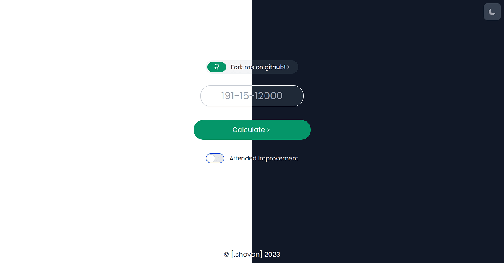

<h1 align="center">Welcome to DIU CGPA Calculator 👋</h1>
<div align="center">
<p>
  
  <a href="https://github.com/shovon668/diu-cgpa/blob/main/README.md" target="_blank">
    
  </a>
  <a href="https://github.com/shovon668/diu-cgpa/blob/main/LICENSE" target="_blank">
    
  </a>
  <a href="https://redirect.shovon.me/twitter" target="_blank">
    
  </a>
</p>

> A Responsive Web Interface for Calculating CGPA or Cumulative Grade Point Average of DIU Students.



### 🏠 [Homepage](https://diu-cgpa.shovon.me)

### ✨ [Demo](https://diu-cgpa.shovon.me)

</div>

## Pre Requirements
- API endpoint environment variable

.env file Example
```
REACT_APP_API_FULL="https://diu-cgpa-api.shovon.me/?get=fullResult&studentId="
```


## Install

```sh
npm install
```

## Usage

```sh
npm run start
```

## Author

👤 **shovon668**

* Website: shovon.me
* Twitter: [@shovon668](https://redirect.shovon.me/twitter)
* Github: [@shovon668](https://github.com/shovon668)
* LinkedIn: [shovon668](https://redirect.shovon.me/linkedin)

## 🤝 Contributing

Contributions, issues and feature requests are welcome!<br />Feel free to check [issues page](https://github.com/shovon668/diu-cgpa/issues). You can also take a look at the [contributing guide](https://github.com/shovon668/diu-cgpa/blob/main/README.md).

## Show your support

Give a ⭐️ if this project helped you!

## 📝 License

Copyright © 2023 [shovon668](https://github.com/shovon668).<br />
This project is [GPL-3.0](https://github.com/shovon668/diu-cgpa/blob/main/LICENSE) licensed.

***
_This project is made with ❤️_