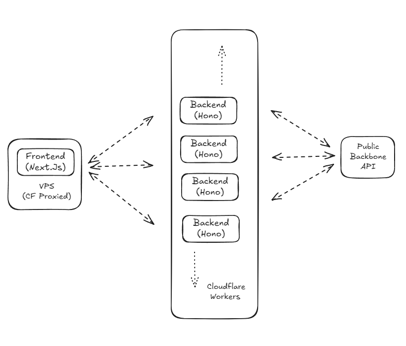

# DIU CGPA Calculator

> Notice: The project is not longer maintained

Welcome to the DIU CGPA Calculator project! This tool helps students of DIU to calculate their CGPA easily and accurately.

## Technical Overview



The frontend is built with Next.js and hosted on a VPS, served through Cloudflare with aggressive caching rules to ensure fast load times. The backend API is developed using Hono.js, designed specifically for deployment on Cloudflare Workers.

To handle request limits, multiple API workers are deployed in parallel. In fact, the entire application can be fully deployed on Cloudflare's platform, leveraging their free tier for both frontend and backend services.

## Technologies Used

- [Next.js 15](https://nextjs.org/docs/getting-started)
- [NextUI v2](https://www.heroui.com)
- [Tailwind CSS](https://tailwindcss.com/)
- [Tailwind Variants](https://tailwind-variants.org)
- [TypeScript](https://www.typescriptlang.org/)
- [Framer Motion](https://www.framer.com/motion/)
- [next-themes](https://github.com/pacocoursey/next-themes)
- [Hono](https://hono.dev)
- [Zod](https://zod.dev/)
- [Cloudflare Worker](https://workers.cloudflare.com/)
- [PNPM Workspace](https://pnpm.io/workspaces)

## Development

```bash
pnpm install

pnpm dev

```
